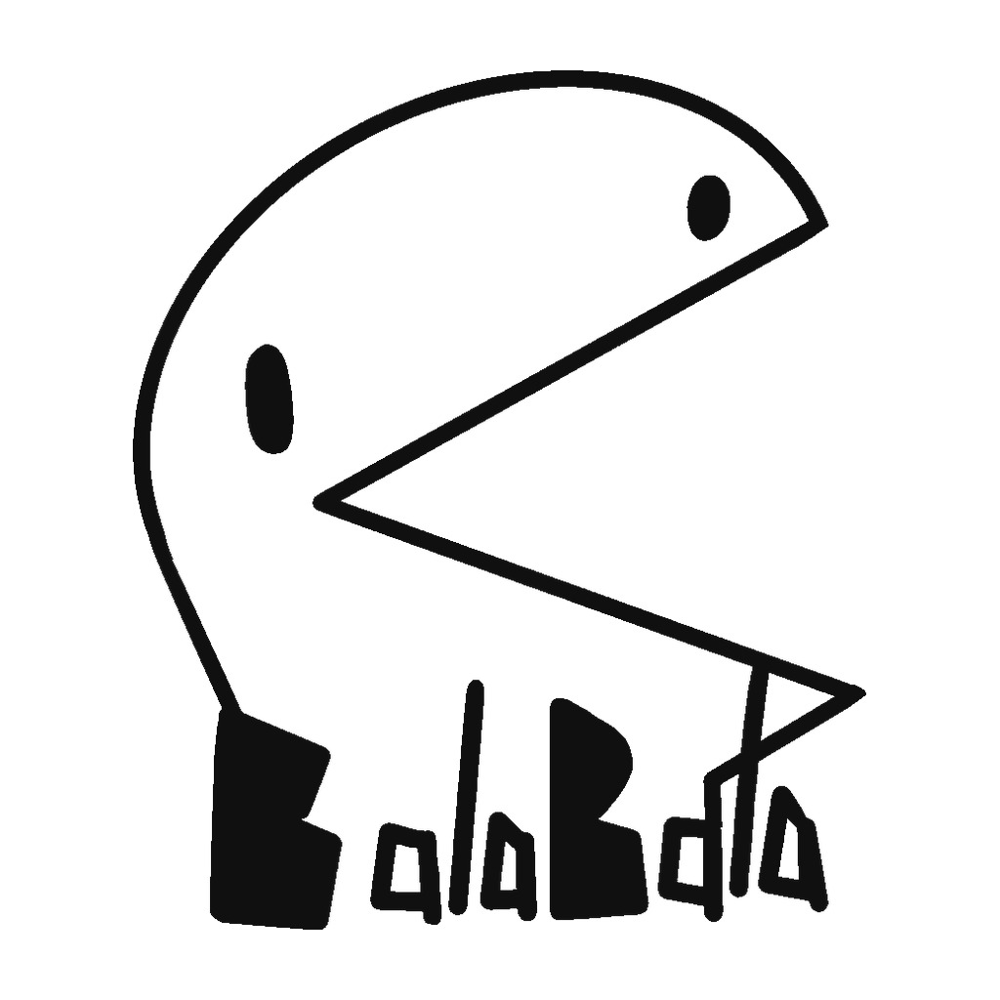

<div align="center">



# 叽里呱啦 · BalaBala

### 一座 AI 原生的 3D 开放世界社交与创作平台

走进原神式可自由探索的 3D 开放世界广场，六座主题建筑沿道路分布——
趣味法庭、脱口秀剧场、狼人杀馆、酒吧、健身房、图书馆，每一座都能真正「走进去」；
和古今中外名人对话辩论，用一句话让 AI 生成专属 3D 场景与小游戏，亲自当造物主。

<br />


<br />

**[🚀 快速开始（本地启动）](#本地启动)**

</div>

---

## 🎯 这是什么

**叽里呱啦（BalaBala）是一个 AI 原生的 3D 社交产品。** 你会先走进一座中央广场，六座主题建筑环绕四周——趣味法庭、脱口秀剧场、狼人杀馆、酒吧、健身房、图书馆，每一座都能真正「走进去」。

建筑里住着 **100 位古今中外历史人物**：从秦始皇、汉武帝、李白、诸葛亮，到凯撒、拿破仑、爱因斯坦、马克思……人物馆全屏环形 3D 选人，每位配有风格化开场短片（水墨/油画/版画/壁画等艺术演绎，9:16 竖版 15 秒）；其中 **20 位核心名人**拥有独立人设、3D 全身形象和符合身份的声音，能和你对话、辩论、同台表演。你也可以**上传一张照片，生成属于自己的 3D 人物**。

不止于「玩」，你还能当**造物主**：在「场景工作室」里用一句话描述想要的世界，AI 自动生成地形、植被、建筑与道具，再把名人或你自己创造的角色作为 AI NPC 布置进去、配上玩法，保存后即可第三人称进入——你创造的世界，也能分享给大家。

## ✨ 核心亮点

- 🛠️ **自定义场景工作室 · 当造物主**：一句话描述想要的世界，AI 自动生成地形、植被生态、建筑与道具（缺失的用 Tripo 实时 3D 建模）；把名人/自定义角色作为 AI NPC 自由摆位（自带人设、技能与专属语音），选择探索/收集/到达/任务玩法，保存后第三人称进入体验，数据驱动、可持续扩展。
- ⚖️ **AI 趣味法庭 · 玩家驱动招牌玩法**：你当原告或被告本人，亲自发言上屏、出示证据、质问对方；AI 辩护人围绕你的策略展开，对方即时接茬回应；局势优势条实时反映双方强弱，判决结果归因到你的关键表现；3 个预置生活小案一键快速开庭，30 秒内进入互动。
- 🎭 **六座可进入的 3D 场景**：趣味法庭、脱口秀剧场、狼人杀馆、酒吧辩论赛、健身房、图书馆，各有完整玩法与专属空间，**全部开放**。
- 🎬 **百位历史人物开场短片**：100 位古今中外名人（帝王将相、文人思想、近现代先驱、西方古典与近代），每人一支 9:16 竖版 15 秒风格化视频，水墨/油画/版画/壁画/泥塑等艺术演绎，人物馆环形 3D 选人时播放。
- 👥 **20 位核心名人深度可互动**：独立人格（persona）＋ 3D 全身模型 ＋ 符合人设的语音，可对话、组队，担任你的教练、评委、对手或队友。
- 🪄 **照片一键生成 3D 人物**：上传全身照或用文字描述，AI 生成可对话、可进入任意场景的专属 3D 角色。
- 🌐 **3D 中央广场 ＋ 实时多人**：点击地面移动、点击建筑进入，实时看到其他在线玩家；WebSocket 断线自动重连。
- 🛠️ **完整 AI 创作工具链**：AI 帮写段子与文案、TTS 语音合成、AI 视频生成，精彩内容一键发布到广场。

## 🛠️ 自定义场景工作室（AI 造物）

「场景工作室」让不写代码的人也能用 AI 创造可玩的 3D 世界：

1. **描述世界**：一句话描述你想要的场景（如「一座有瀑布和古代酒馆的仙侠山谷，李白在门口迎客」），可让 AI 智能优化。
2. **AI 生成蓝图**：大模型把描述解析为结构化场景蓝图——地形主题与起伏、水面/天气/光照、植被生态撒点、建筑与道具清单、NPC 阵容与站位、出生点与玩法目标。
3. **资产生成与复用**：树/草/岩石等复用内置资产库并实例化；蓝图里缺失的关键建筑/道具自动交给 Tripo 文本生成 3D 模型，归一化（落地、居中、统一缩放）后入库。
4. **布置 AI NPC**：从 20 位名人或你的自定义人物中挑选角色放入场景，每个 NPC 自带人设（persona）、技能（skill）与符合身份的语音，可设置身份（掌柜 / 守卫 / 任务发布者…）与站位。
5. **选择玩法**：内置四种轻量模板——**对话探索、物品收集、到达目标、NPC 任务链**，AI 按描述自动推荐并配置目标。
6. **保存进入**：一键发布，第三人称走进你创造的世界，与 NPC 对话、拾取物品、完成目标。

> 场景蓝图与运行时解耦：地形、撒点、结构、NPC、玩法全部是可序列化数据，便于二次编辑、分享与扩展，未来可作为传送子区域接入更大的开放世界。

## 🧱 技术速览

**前端**：React 18 · Three.js / React Three Fiber · Vite · PWA　｜　**后端**：Fastify · SQLite · WebSocket　｜　**AI**：StepFun / EvoMap（大模型）· Tripo（3D 生成）· StepFun TTS（语音）

---
## 场景玩法（M9–M11）

### 🎤 脱口秀剧场（玩家驱动·开放麦之星）
- **三阶段开放麦**：AI 主持 15 秒热身 → 玩家上台连续讲 3 个笑话 → AI 观众实时打分（笑声分贝 0-100）→ 平均分定段位（冷场/尚可/炸场/今日之星）
- 每个笑话提交后即时反馈：笑声分贝条动画 + reaction emoji + 观众评论
- 结果页展示三分数柱状图、段位徽章、「再来一轮」
- 名人 open-mic：选择一位名人，用其 persona 现场讲短段子
- AI 帮写：输入主题和风格，AI 生成可直接讲的脱口秀文本
- 精彩片段一键发布到广场

### 🍺 酒吧辩论（玩家辩手+裁判胜负闭环）
- 玩家作为正式辩手加入正方或反方，参与完整 3 回合：立论 → 对方反驳 → 总结陈词
- 每回合玩家发言后，对方 AI 针对性反驳（引用玩家具体论点），论据强度条实时变化（左正方明黄/右反方青绿）
- 辩论前可押注虚拟金币，赢了翻倍
- 3 回合结束后裁判 AI（苏格拉底 persona）宣读裁决：胜方、裁决理由、关键瞬间
- AI 自动推荐正反方辩手（名人按 persona + 立场发言）
- 金句/共识一键发布到广场

### 📚 图书馆
- 名人读书会：名人按领域推荐著作，开场介绍并抛出讨论问题，可继续追问
- 深度问答：与名人多轮对话（回复 200-400 字，支持展开论述），每条回答可发布金句
- AI 馆员：按主题（15 个知识主题）回答知识性问题，可发布笔记
- 安静氛围，多人一起参加读书会，提问实时同步

### 🐺 狼人杀馆（压缩等待+玩家每回合有事做）
- 9 人局标准版型：3 狼人 + 1 预言家 + 1 女巫 + 1 猎人 + 3 村民，真人不足时 AI 名人补位
- 完整回合制状态机：夜晚（狼人刀人 → 预言家查验 → 女巫用药）→ 白天（公布死亡 → 发言 → 投票放逐）→ 循环
- **快捷动作卡**：玩家发言时可一键「跳预言家」「查杀 X」「带人上票」「辩解」，动作记录到公开日志影响 AI 决策
- **夜晚好人微操作**：好人夜晚不再干等，可「偷听」（30% 获得模糊情报）或「观察某人」（次日获得行为线索）
- **AI 发言压缩**：每人 1-2 句短句（≤50 字），白天讨论从 3 分钟压到 60 秒，支持 2x 加速
- **本局表现评分**：结束后展示表现分（生存天数×10 + 投中狼×15 + 阵营加成）、关键操作回顾
- 信息严格保密：服务端按玩家视角单独下发快照；每阶段超时自动推进

### 🏋️ 健身房（AI 教练+节奏带练）
- **AI 教练**：3 位风格教练（硬核激励派/呼吸引导派/轻松陪伴派），按 persona 实时语音鼓励与纠错（TTS 朗读）
- **节奏点击带练**：reps 不再自动涨，玩家需在节奏指示器圆点到达中央绿区时按空格/点击，命中 reps+1 并触发教练鼓励，未命中教练纠错
- 训练完成后评分（S/A/B/C，基于节奏命中率+完成度）+ 教练评语 + 打卡成就
- 器械互动：3D 场景内可点击器械，弹出动作要领
- 训练记录与成就：连续天数 streak、累计次数、成就徽章
- 多人云健身：WebSocket 实时同步在线状态，可互相加油

> **未来扩展**：基于摄像头的实时姿态识别（如 MediaPipe / BlazePose），用于动作计数与姿态纠正——当前版本暂不实现，列为后续迭代方向。

## 自定义人物（M12）

平台支持创建完全自定义的 3D 人物，与 20 位预置名人享有同等的对话、场景参与和广场分享能力。

### 创建向导
入口页点击「创建人物」进入四步向导：
1. **选择外观来源**：上传照片（建议从头到脚全身照、中性背景）或文字描述（如「赛博朋克少女：银色短发，霓虹外套」）
2. **生成 3D 模型**：照片经 Tripo `image_to_model`、文字经 Tripo `text_to_model` 生成全身 3D 模型，实时进度 + 3D 预览
3. **填写人设**：名字、身份/头衔、简介、标签、人格描述（persona）、开场白；「AI 帮填人设」一键根据名字和描述生成完整人设（可编辑）
4. **保存**：模型 GLB 与头像落盘到运行时目录，写入 SQLite，默认私有

### 人物馆
人物馆新增三个 tab：
- **全部名人**：20 位预置名人（不变）
- **我的人物**：当前用户创建的所有自定义人物，支持 3D 查看、对话、编辑人设、发布到广场、删除
- **广场人物**：所有用户发布的公开自定义人物，任何人可查看和对话

自定义人物详情对话框：左侧 3D 全身模型查看器（可旋转），右侧资料 + 多轮对话（按 persona 回复，支持 TTS 朗读），owner 可见编辑/发布/删除操作。

### 全场景接入
自定义人物与预置名人共用统一角色解析器（服务端 `resolveCharacter(ref)`，`custom-<uuid>` 前缀查 SQLite，其余走预置名人库），可在以下场景直接选用：
- **趣味法庭合议庭**：BenchSelection 中可选自定义人物作为评委，按其 persona 发言、投票
- **酒吧辩论**：可选自定义人物作为辩手，按 persona + 立场发言
- **脱口秀 / 图书馆 / 狼人杀（AI 玩家）/ 健身房（教练）**：均支持自定义人物以其人设参与

### 可见性与分享
- 默认私有：仅创建者可见、可对话、可引用
- 发布到广场：一键将私有人物改为公开，并在广场生成 `custom_character` 类型人物卡，他人可查看和对话
- 私有他人不可见：详情 API 对非 owner 返回 403，公开列表不包含私有人物
- 删除时自动清理运行时模型/图片文件

### WS 多人化身
用户身份设置中，「自定义」化身选项可从自己的自定义人物中选择一位作为 WS 多人联机化身（`avatarType='custom'`, `avatarRef='custom-<uuid>'`）。

### 运行时文件隔离
用户生成的 GLB 模型和头像存储在 `apps/api/.data/custom-characters/<id>/`（已 gitignore），由 Fastify 安全静态托管（防目录穿越、仅放行 .glb/.jpg/.png/.webp/.gif、按 visibility 鉴权），绝不进入 git 或项目包。

## 趣味法庭重构（M13）

趣味法庭从「左 sidebar + 右小窗 3D」重构为**全屏 3D + 完整案件状态机 + 玩家驱动庭审**。玩家选择当原告或被告本人，亲自发言上屏、出示证据、质问对方；AI 辩护人围绕玩家策略展开，对方即时接茬回应；局势优势条实时反映双方强弱，判决归因到玩家关键表现。

### 案件状态机
`DRAFT → ANALYZING → GENERATED → CONFIRMED → IN_PROGRESS → JUDGING → COMPLETED`

### 创建流程
1. **选择身份**：「我要当原告」或「我要当被告」（必选，玩家即当事人本人）
2. **描述案件**：输入事件描述（≤500字）+ 可选证据；或从 3 个预置生活小案一键快速开庭（跳过 AI 分析等待，30 秒内进入互动）
3. **AI 分析**（快速开庭可跳过）：一次 LLM 调用生成案件标题、结构化事实、争议点、双方角色与知识库
4. **预览确认**：三栏展示事实/原告诉求/被告诉求，可选邀请名人或自定义人物作为辩护人
5. **开始庭审**：进入全屏 3D 法庭，默认视角为玩家身份方

### 庭审循环（玩家驱动）
- 每轮：法官简短开场 → **玩家方发言**（轮到你时输入面板自动展开聚焦，发言即时上屏为「你」的气泡）→ 对方 AI 当事人即时接茬回应 → 双方辩护人追加 → 法官更新记录 → 局势优势条更新
- 玩家发言超时（60s）由辩护人代述一句，庭审不卡死
- 最多 5 轮；法官根据未决争议点决定是否继续
- 每次发言独立保存为 CourtTurn（speaker 含 `player`，玩家发言真实上屏进入 transcript）
- **局势优势条（momentum）**：玩家发言 +5、出示证据 +8、AI 发言 +3，实时 0-100 双向条，判决结果受最终局势影响

### 玩家介入（核心亮点）
- **玩家即当事人**：选择原告/被告后，该方不再由 AI 自动发言，而是等玩家亲自发言
- 玩家发言即时上屏（speaker='player' 的 CourtTurn），对方 AI 下一句针对性回应
- 可随时补充证据（上传文件），证据计入局势优势并被判决引用
- 视角切换原告↔观众↔被告仅改变 UI 展示，玩家身份在创建时已确定
- 判决页展示「你的表现」：最终局势条、发言次数、法官归因（"由于你当庭出示 X……"）

### 信息可见性（服务端权威，类似狼人杀视角过滤）
- 观众只看双方「已公开」论点证据，**看不到内部 KnowledgeBase 底牌**
- 原告视角看不到被告 KB，被告视角看不到原告 KB
- WS 中按用户视角单发过滤后快照，PlayerInput 只广播给同视角用户

### 判决
- should_continue=false 后进入 JUDGING，综合 Case+Facts+Evidence+全部Turn+CourtRecord+PlayerInputs 生成结构化 CourtVerdict
- 胜负按**事实权重/证据/逻辑/反驳有效性**判定（plaintiff/defendant/mixed/dismissed），而非「谁先没话说」
- 判决含 case_summary/key_facts/key_evidence/双方arguments/judge_analysis/reasoning/conclusion
- 可发布到广场（`court_verdict` 内容类型）

### 全屏 3D UI
- Canvas 全屏背景（fixed inset 0，无小窗口、无侧边留白）
- 顶部栏：案件标题/轮次/状态/在线人数/邀请/返回
- 底部中央面板：当前发言+法官记录摘要+视角切换+玩家输入
- 深色半透明面板（rgba 深色 + 明黄 #FFD60A），OrbitControls 不拦截上层 UI
- 移动端全屏 3D + 底部面板，触控可用

### 名人合议庭模式（保留）
创建向导中「名人合议庭模式」按钮可切换回旧流程（左侧配置 + BenchSelection + 名人合议庭 SSE），旧资产未删未改。

## 本地启动

在项目根目录复制 `.env.example` 为 `.env`，填入服务端密钥（STEPFUN、EVOMAP、TRIPO）。密钥只给 API 服务使用，不会进入前端 bundle。

```powershell
npm install
npm run dev          # 同时启动 API (8787) + Web (5173)
# 或分别启动：
npm run dev:api      # Fastify API: http://localhost:8787
npm run dev:web      # Vite Web: http://localhost:5173
```

构建：

```powershell
npm run build        # 全量构建（shared + api + web）
```

测试：

```powershell
npm test             # 运行后端 Vitest 测试（狼人杀状态机 / 合议庭编排 / db CRUD / WS 广播过滤）
```

## 自动化测试

核心纯逻辑使用 **Vitest** 覆盖：后端 **158** 个、前端 **85** 个用例，全部 mock 外部服务（LLM / Tripo / TTS），零网络依赖、确定性通过。

| 后端测试文件 | 用例数 | 覆盖范围 |
|---|---|---|
| `werewolf-orchestrator.test.ts` | 20 | 阶段推进、胜负判定、视角过滤、信息隔离、AI 补位、战报 |
| `db.test.ts` | 19 | 案件/内容/评论/反应去重与点赞累加/用户/证书/消息/场景记录 DAO + 重启持久化 |
| `bench-orchestrator.test.ts` | 9 | 合议庭流程事件序列、投票统计、互动消费、非法 JSON 兜底 |
| `ws.test.ts` | 8 | 房间广播隔离、私密单发、场景房间状态、scene_event 广播 |
| `gym-orchestrator.test.ts` | 15 | 训练计划生成、streak 连续天数计算（含跨月/断档）、成就解锁判定（器械分类/累计阈值） |
| `custom-character-db.test.ts` | 17 | 自定义人物 CRUD、多用户隔离、可见性过滤、tags 序列化 |
| `character-resolver.test.ts` | 7 | 统一角色解析：预置名人/自定义人物/未知 ref/批量解析/URL 转换 |
| `court-state.test.ts` | 16 | M13 状态机流转/非法流转/视角过滤/发言上下文 |
| `court-db.test.ts` | 13 | M13 案件/证据/事实/turn/player_input/verdict DAO CRUD |
| `court-orchestrator.test.ts` | 7 | M13 AI分析/庭审流程/player input消费/错误路径 |
| `character-voices.test.ts` | 9 | 名人/自定义人物语音映射、音色选择、TTS 请求与兜底 |
| `normalize-character-model.test.ts` | 5 | 全身模型归一化（落地/居中/统一身高）、全身/半身判定 |
| `skill.test.ts` | 13 | 名人技能（skill）加载、解析、检索与匹配 |

**前端另有 85 个用例（4 文件）**：`courtroom-camera.test.ts`（34，法庭机位/视角切换）、`character-gallery.test.ts`（29，人物馆环形选人/画廊）、`courtroom-seats.test.ts`（17，席位布局/人物转向）、`character-voices.web.test.ts`（5，语音开关/朗读）。

测试使用临时 SQLite 文件（`process.env.DB_PATH` 覆盖），每个测试文件独立数据库，`afterAll` 清理。GitHub Actions 在 push/PR 时自动运行 `npm test` + `npm run build`。

## 数据持久化（M7）

所有业务数据使用 SQLite（Node 22 内置 `node:sqlite`，零原生依赖）持久化，数据库文件位于 `apps/api/.data/app.db`（已 gitignore）。重启 API 不丢数据。

持久化内容包括：
- 用户身份（昵称、化身）
- 案件与判决书
- 合议庭完整发言记录
- 广场内容、评论、点赞/反对
- 证书、消息
- 场景交互记录（脱口秀表演、酒吧发言、图书馆问答）
- 狼人杀对局记录与战报
- 健身训练计划、打卡记录、连续天数 streak、成就徽章
- 自定义场景蓝图、NPC 布置与生成资产记录

首次启动自动填充广场演示内容。

## 用户身份（M7）

首次进入应用时，设置昵称并选择化身（胶囊 / 名人 / 自定义），系统颁发稳定 `userId` 存入 localStorage。发布、发言、站队、证书、消息均归属该身份。

- 轻量匿名身份，无需密码
- 跨刷新、跨设备（同一 userId）数据一致
- 「我的」页面展示参与的庭审、发布的内容、证书墙、消息通知

## 实时多人（M7）

基于 `@fastify/websocket` 的房间制实时联机：

### 广场
- 进入广场自动连接 `plaza` 房间
- 实时看到其他在线用户的化身（胶囊 + 名牌），位置 10Hz 节流同步 + 客户端插值
- 左上角显示在线人数
- 点击地面移动，位置实时同步给房间内其他人

### 法庭房间
- 启动合议庭后自动创建 `court:<caseId>` 房间
- 点击「邀请他人」复制房间链接（`/?room=court:<caseId>`）
- 他人通过链接进入后，实时看到合议庭辩论、发言、站队
- 房间内所有用户的发言和投票实时同步
- 断线自动重连，迟到加入者先收到当前状态快照

vite 已配置 `/api` 的 WebSocket 代理（`ws: true`）。

## 主要 API

### 身份
- `POST /api/users` — 创建或更新用户（`{ nickname, avatarType, avatarRef, userId? }`）
- `GET /api/users/:userId` — 获取用户资料

### 我的
- `GET /api/users/:userId/cases` — 我参与的案件
- `GET /api/users/:userId/contents` — 我发布的内容
- `GET /api/users/:userId/certificates` — 我的证书
- `POST /api/users/:userId/certificates` — 生成证书
- `GET /api/users/:userId/messages` — 消息列表
- `PUT /api/users/:userId/messages/:msgId/read` — 标记已读
- `PUT /api/users/:userId/messages/read-all` — 全部已读

### 案件与庭审
- `POST /api/cases` — 创建案件（可选 `userId`）
- `GET /api/cases/:id` — 获取案件
- `GET /api/archives` — 已判决案件列表
- `POST /api/cases/:id/bench/stream` — 多名人合议庭 SSE 流
- `POST /api/cases/:id/bench/interact` — 用户互动（发言/举证/站队/点名）
- `POST /api/cases/:id/share` — 生成分享链接
- `POST /api/cases/:id/publish` — 发布判决书到广场

### 广场
- `GET /api/contents` — 内容列表（支持 sort/scene/topic 筛选）
- `POST /api/contents` — 发布内容（可选 `userId`）
- `GET /api/contents/:id` — 内容详情
- `POST /api/contents/:id/react` — 点赞/反对（可选 `userId`，去重）
- `POST /api/contents/:id/comments` — 评论

### 脱口秀剧场
- `POST /api/talkshow/perform` — 上台表演，返回观众评分/反应/评论
- `POST /api/talkshow/celebrity` — 名人 open-mic 讲段子
- `POST /api/talkshow/ai-write` — AI 帮写段子
- `POST /api/talkshow/publish` — 发布精彩片段到广场

### 酒吧辩论
- `GET /api/bar/topics` — 话题库
- `POST /api/bar/start` — 开始辩论（AI 推荐正反方辩手）
- `POST /api/bar/speak` — 名人发言
- `POST /api/bar/user-speak` — 用户发言
- `POST /api/bar/summarize` — 酒保总结共识与金句
- `POST /api/bar/vote` — 投票评更有趣的一方
- `POST /api/bar/publish` — 发布金句到广场

### 图书馆
- `GET /api/library/topics` — 知识主题列表
- `POST /api/library/celebrity-chat` — 名人深度问答
- `POST /api/library/recommend` — 名人推荐著作
- `POST /api/library/book-club` — 开始名人读书会
- `POST /api/library/librarian` — AI 馆员答疑
- `POST /api/library/publish` — 发布笔记/金句到广场

### 狼人杀馆
- `POST /api/werewolf/create` — 创建房间（`{ userId }`）
- `POST /api/werewolf/:gameId/join` — 加入房间（`{ userId }`）
- `POST /api/werewolf/:gameId/start` — 房主开始游戏（`{ userId }`）
- `GET /api/werewolf/:gameId/state?userId=` — 获取该玩家视角快照（断线重连用）
- `POST /api/werewolf/:gameId/publish` — 发布战报到广场（游戏结束后）

### 健身房
- `POST /api/gym/plans` — 生成训练计划（`{ goal, level?, durationMinutes?, userId? }`）
- `GET /api/gym/plans?userId=` — 用户最近训练计划
- `POST /api/gym/checkins` — 打卡（自动重算 streak + 解锁成就），返回 `{ checkin, stats, newAchievements }`
- `GET /api/gym/checkins?userId=&limit=` — 打卡记录
- `GET /api/gym/stats/:userId` — 健身统计（连续天数/最长/累计次数/分钟）
- `GET /api/gym/achievements/:userId` — 成就徽章列表（含解锁状态）
- `POST /api/gym/celebrity-coach` — 名人风格健身教练对话（`{ celebrityId, message, goal? }`）
- `POST /api/gym/publish` — 发布打卡到广场（`gym_checkin` 类型）

### 自定义人物（M12）
- `POST /api/custom-characters/finalize` — 完成创建：下载 Tripo GLB + 头像落盘 + 写库（`{ userId, name, persona, tripoTaskId, title?, intro?, tags?, greeting?, portraitDataUrl?, visibility? }`）
- `POST /api/custom-characters` — 直接创建记录（`{ userId, name, persona, modelPath?, portraitPath?, ... }`）
- `GET /api/custom-characters/mine?userId=` — 我的自定义人物列表（不含 persona）
- `GET /api/custom-characters/public` — 公开自定义人物列表
- `GET /api/custom-characters/:id?userId=` — 详情（私有需 owner 鉴权，不含 persona）
- `PUT /api/custom-characters/:id` — 更新（需 owner）
- `DELETE /api/custom-characters/:id` — 删除（需 owner，自动清理运行时文件）
- `POST /api/custom-characters/:id/chat` — 与自定义人物对话（私有需 owner）
- `POST /api/custom-characters/:id/publish` — 发布到广场（需 owner，置 public + 生成人物卡）
- `GET /api/custom-characters/assets/:id/:filename` — 运行时文件静态托管（防目录穿越）

### 趣味法庭 M13（全屏 3D + 案件状态机）
- `POST /api/court/cases` — 创建案件（DRAFT），body `{userId, userInput, evidence?}`
- `POST /api/court/cases/:id/analyze` — AI 分析（→GENERATED，生成事实/争议点/双方角色+知识库）
- `POST /api/court/cases/:id/regenerate` — 重新分析
- `POST /api/court/cases/:id/confirm` — 确认（→CONFIRMED）
- `POST /api/court/cases/:id/start` — **SSE 流**，开庭审理（多轮辩论→判决），body `{userId, perspective, defenderAssignments?}`
- `POST /api/court/cases/:id/player-input` — 玩家补充弹药（更新该方知识库），body `{userId, playerRole, type, content, evidenceName?}`
- `GET /api/court/cases/:id?userId=&perspective=` — 案件详情（**视角过滤**：观众看不到双方 KB）
- `GET /api/court/cases/:id/turns` — 庭审发言记录（公开）
- `GET /api/court/cases/:id/verdict` — 判决（公开）
- `POST /api/court/cases/:id/publish` — 发布判决到广场（`court_verdict` 类型）

### 自定义场景工作室
- `POST /api/scene-studio/generate` — 自然语言生成场景蓝图并构建资产（**SSE 进度**），body `{userId, description, options?}`
- `GET /api/scene-studio/list?userId=` — 场景列表
- `GET /api/scene-studio/:id` — 场景详情（蓝图）
- `PUT /api/scene-studio/:id` — 编辑蓝图（增删挪 NPC / 结构 / 道具、改玩法）
- `POST /api/scene-studio/:id/npc` — 添加 / 布置 AI NPC（`{characterId, position, role?}`）
- `POST /api/scene-studio/:id/publish` — 保存发布
- `DELETE /api/scene-studio/:id` — 删除场景
- `GET /api/scene-studio/:id/play` — 运行时数据（解析后蓝图 + 资产 URL + NPC 资源）

### WebSocket
- `GET /api/ws?userId=<id>&room=plaza|court:<caseId>|talkshow:<id>|bar:<id>|library:<id>|werewolf:<gameId>|gym:lobby` — 实时连接
- 场景房间：脱口秀/酒吧/图书馆/健身房各使用 `talkshow:lobby` / `bar:lobby` / `library:lobby` / `gym:lobby`，通过场景专属事件广播（表演、发言、问答、打卡、加油等）
- 狼人杀房间：`werewolf:<gameId>`，客户端发送 `werewolf_action`（夜晚行动/发言/投票），服务端对每个玩家单独下发 `werewolf_snapshot`（含私密信息），对全员广播 `werewolf_event`（公开阶段/死亡/发言/投票/胜负）

### 其他
- `GET /health` — 服务健康与配置状态
- `POST /api/tripo/tasks` — Tripo 3D 模型生成
- `POST /api/tts` — StepFun TTS 语音合成
- `POST /api/ai/polish` — AI 帮写润色

## 模型路由

庭审生成使用统一的结构化 JSON 协议，按以下顺序调用：

1. StepFun：`https://api.stepfun.com/v1`
2. EvoMap：`https://api.evomap.ai/v1`
3. 本地兜底：外部模型不可用时仍能完成演示

切换模型只需修改 `.env`，不需要改庭审流程。

## 3D 场景

平台使用 Three.js + React Three Fiber 实时渲染。广场为 3D 可交互场景（点击地面移动、点击建筑进入），六个建筑环绕广场：趣味法庭、脱口秀剧场、狼人杀馆、酒吧辩论、健身房、图书馆。

室内场景均为程序化 3D 建模（三面布景 + 主题道具），延续 Q 版圆润 + 纯黑明黄视觉语言：
- 趣味法庭：写实法庭 + 多席位合议庭
- 脱口秀剧场：舞台 + 麦克风 + 观众席 + 聚光灯
- 狼人杀馆：夜晚圆桌 + 9 号码位 + 昼夜光照切换 + 死亡标记 + 发言者高亮
- 酒吧辩论：吧台 + 酒瓶 + 圆桌 + 暖光氛围
- 健身房：明亮运动风 + 6 件可交互器械（跑步机/哑铃架/杠铃卧推凳/瑜伽垫/划船机/动感单车）+ 镜子墙 + 分区地面
- 图书馆：三面书架 + 阅览桌 + 台灯 + 安静氛围

## 移动端适配与 PWA（M10）

### 响应式设计
- 主断点 `768px`，超小屏补充 `380px`
- **顶部导航**：小屏改为底部固定 Tab 栏（56px），3 个主项等宽分布，当前页明黄高亮，适配 iPhone 底部安全区
- **场景控制面板**：小屏改为底部抽屉 / 全屏面板，可展开收起
- **入口大厅 / 广场卡片 / 案卷库 / 我的页**：小屏网格降列（4→2→1），搜索框全宽
- 全局触控热区 ≥44×44px

### 3D 触屏操作
- 广场支持**点地面移动**、**点建筑/名人进入**
- tap / drag 智能区分（位移 <10px 且时长 <400ms 才算 tap），避免旋转视角时误触发点击
- 桌面端鼠标操作不受影响

### PWA（vite-plugin-pwa）
- 可安装到桌面 / 主屏幕，独立窗口运行（`display: standalone`）
- 离线壳：HTML / JS / CSS / 图片缓存，断网仍可打开应用
- 3D 大模型（`.glb`）使用 NetworkOnly，不进强缓存，避免占用存储
- 主题色纯黑 `#000000` + 明黄 `#FFD600`，图标使用产品 logo
- Service Worker 自动更新（`autoUpdate`）

## 健壮性（M10）

### Error Boundary
- 根级 + 每个懒加载场景 + 3D 场景内部三层 ErrorBoundary
- 3D / GPU 崩溃时显示友好回退 + 「重新加载」按钮
- 懒加载 chunk 失败可点击重试
- Suspense fallback 统一为明黄 spinner + 「加载中…」

### 全局错误兜底
- `window.onerror` + `unhandledrejection` 捕获未捕获异常，显示用户友好提示（不暴露技术栈），原始错误仍输出 console

### WebSocket 断线重连
- 合议庭 / 狼人杀房间使用指数退避重连（1s → 2s → 4s → … → 30s 封顶）
- 重连期间明黄顶栏提示「连接中断，正在重连…（第 N 次）」，重连成功自动拉取当前状态快照

### 内存管理
- 每个 3D 场景 unmount 时 dispose 几何体 / 材质 / 纹理，并清除 drei `useGLTF` 模型缓存
- 共享环境资源（Environment / Lightformer 贴图）不受影响
- 多场景切换无明显内存累积

### 首屏性能
- 入口页（RoomEntry）不含 3D 代码，three / r3f 拆为独立 chunk（分别 ~688KB / ~552KB），进入 3D 场景才按需加载
- 入口 chunk 仅 ~122KB（gzip ~45KB）

## 项目结构

```
apps/
  api/          # Fastify 后端（SQLite + WebSocket + LLM 编排）
    src/
      db.ts           # SQLite 持久化层
      ws.ts           # WebSocket 房间管理
      server.ts       # 路由与服务入口
      storage.ts      # 案件存储（委托 db.ts）
      content-storage.ts  # 广场内容存储（委托 db.ts）
      bench-orchestrator.ts  # 多名人合议庭编排
      talkshow-orchestrator.ts  # 脱口秀 AI 编排
      talkshow-routes.ts  # 脱口秀路由
      bar-orchestrator.ts  # 酒吧辩论 AI 编排
      bar-routes.ts   # 酒吧辩论路由
      library-orchestrator.ts  # 图书馆 AI 编排
      library-routes.ts  # 图书馆路由
      werewolf-orchestrator.ts  # 狼人杀状态机 + AI 玩家 + 视角过滤
      werewolf-routes.ts  # 狼人杀路由
      gym-orchestrator.ts  # 健身房纯逻辑（计划生成/streak计算/成就判定）
      gym-routes.ts  # 健身房路由
      tripo.ts        # Tripo 3D API 封装
      character-resolver.ts  # M12: 统一角色解析（预置名人 + 自定义人物）
      custom-character-routes.ts  # M12: 自定义人物 CRUD/对话/发布/文件托管
      court-state.ts    # M13: 状态机/视角过滤/发言上下文（纯逻辑）
      court-orchestrator.ts  # M13: AI分析+庭审循环+判决编排
      court-routes.ts   # M13: 案件 CRUD/分析/SSE庭审/玩家输入/判决
      scene-studio/      # 自定义场景工作室：scene-planner(AI蓝图)/scene-asset-builder(Tripo资产)/scene-db/scene-routes
  web/          # Vite + React 18 + R3F 前端
    src/
      identity.tsx    # 用户身份 Provider
      App.tsx         # 应用入口与路由
      CourtroomShell.tsx  # 合议庭状态机 + 多人联机
      CourtroomView.tsx   # 法庭 3D 场景
      TalkshowShell.tsx   # 脱口秀 UI 壳 + 多人
      TalkshowView.tsx    # 脱口秀 3D 场景
      BarShell.tsx        # 酒吧辩论 UI 壳 + 多人
      BarView.tsx         # 酒吧 3D 场景
      LibraryShell.tsx    # 图书馆 UI 壳 + 多人
      LibraryView.tsx     # 图书馆 3D 场景
      WerewolfShell.tsx   # 狼人杀 UI 壳 + 游戏状态 + 多人
      WerewolfView.tsx    # 狼人杀 3D 圆桌场景
      GymShell.tsx        # 健身房 UI 壳 + AI教练/器械/名人/多人/记录 + WS
      GymView.tsx         # 健身房 3D 场景（6 件可交互器械）
      Plaza3D.tsx     # 3D 广场 + presence
      RoomEntry.tsx   # 场景入口大厅
      MyPage.tsx      # 我的页面
      CharacterHall.tsx  # 人物馆（名人 + 自定义人物，三 tab）
      CustomCharacterStudio.tsx  # M12: 自定义人物创建向导
      custom-characters.ts  # M12: 前端统一角色 helper
      CourtroomM13.tsx  # M13: 全屏3D法庭主编排（向导/庭审/判决+WS）
      CourtCreationWizard.tsx  # M13: 四步创建向导
      CourtTrialPanel.tsx  # M13: 庭审底部面板（发言/记录/视角/玩家输入）
      CourtVerdictPanel.tsx  # M13: 判决展示面板
      scene-studio/      # 自定义场景：SceneStudio(创作向导)/SceneRunner(运行时)/MyScenes(列表)
packages/
  shared/       # 共享类型与名人数据
```

## 技术栈

- **后端**：Fastify 5 + node:sqlite + @fastify/websocket + undici
- **前端**：Vite 5 + React 18 + React Three Fiber + drei + three + vite-plugin-pwa
- **测试**：Vitest（后端 158 + 前端 85 用例）
- **共享**：TypeScript 类型 + 名人数据
- **CI**：GitHub Actions（push/PR 自动跑 test + build）
- **AI**：StepFun / EvoMap（庭审生成、名人对话、润色）、Tripo（3D 模型）、StepFun TTS
