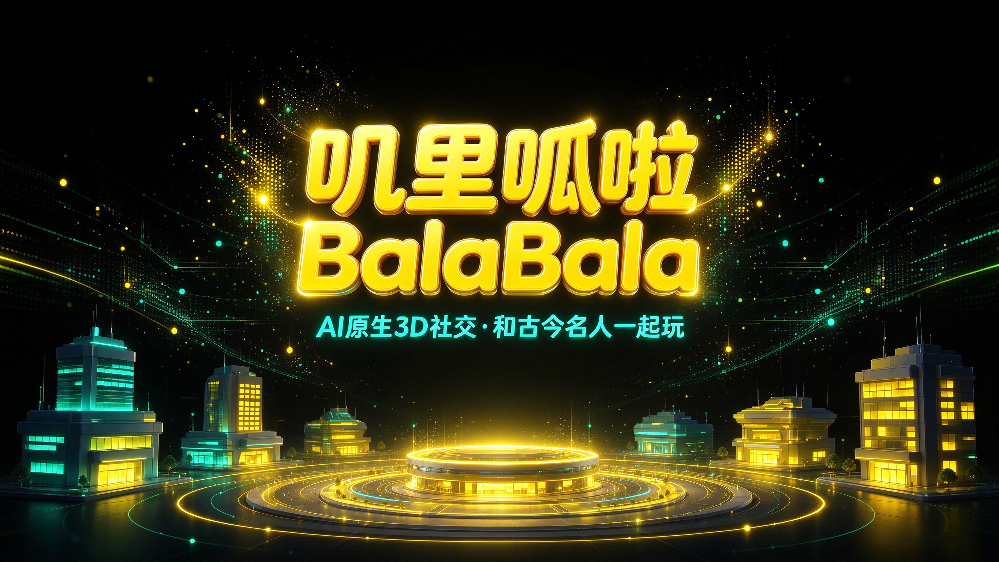
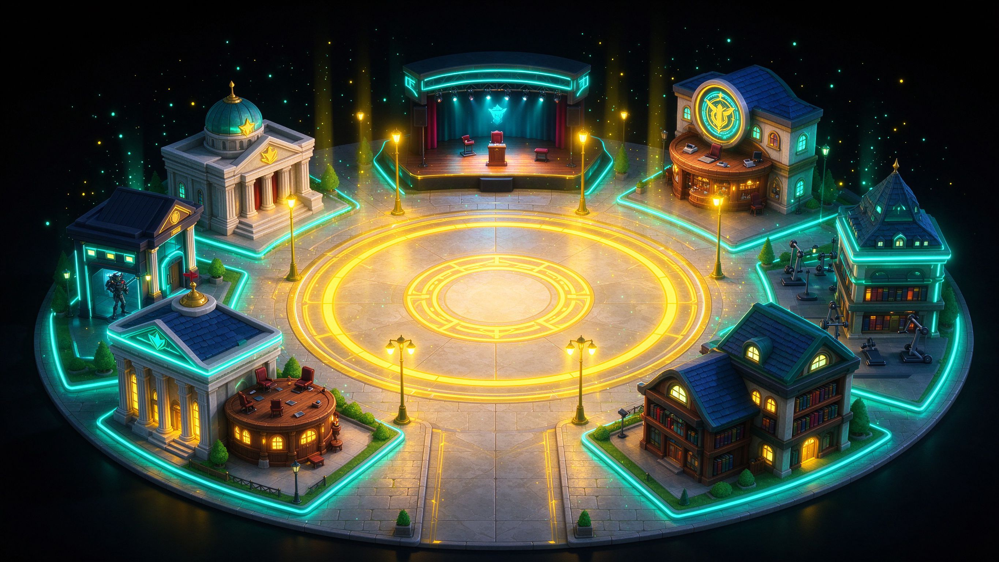
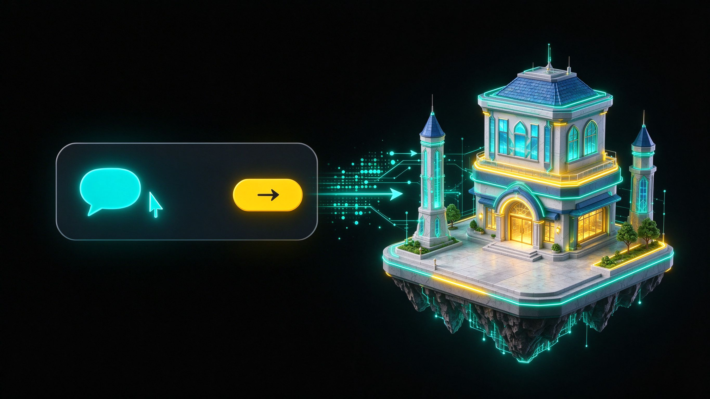

# 叽里呱啦 BalaBala · 项目介绍

> AI 原生 3D 社交与 UGC 平台 —— 和古今中外名人一起玩。



## 项目愿景

我们相信下一代社交空间不应该是"空旷的世界等人来填"，而应该是**开箱即玩、单人也能开局、用一句话就能再造一个世界**的 AI 原生空间。

叽里呱啦 BalaBala 的愿景是：把**社交博弈玩法**与**生成式 AI** 结合，让百位古今中外名人成为随时在线的对手、队友与观众——一个人上线也能开局，说句话就能造一个新场景，让每个人都能拥有属于自己的、永远不会冷场的 3D 社交世界。

## 一句话简介

**叽里呱啦 BalaBala 是一个 AI 原生的 3D 社交与 UGC 平台**：你进入一座原神式的中央发光广场，周围环绕 6 座主题玩法建筑，百位古今中外名人作为 AI NPC 随时陪你玩、陪你辩、陪你演——一个人上线也能开局，说句话就能造一个新场景。

---

## 一、产品定位

| 维度 | 说明 |
|---|---|
| 品类 | AI 原生 3D 社交 + UGC 玩法平台 |
| 核心体验 | 中央广场社交锚点 + 6 座主题建筑即点即玩 |
| 目标用户 | 喜欢社交博弈、脱口秀、剧本杀、知识竞技的年轻用户 |
| 上线形态 | 浏览器优先（PWA），无需下载安装 |
| 一句话卖点 | **AI 原生 3D 社交·和古今名人一起玩** |

---

## 二、核心功能清单

### 1. 中央广场（社交锚点）



- 原神式发光 3D 圆形广场，作为所有玩法的枢纽。
- 周围环绕 6 座主题建筑剪影，点击即传送进入对应场景。
- 百位名人头像光点在广场间流动汇聚，形成"名人随时在场"的氛围。
- **新手引导 3 次点击直达游戏**：开屏 → 选一个名人搭子 → 进场景开玩。

### 2. 六大场景玩法

| 场景 | 玩法核心 | 关键机制 |
|---|---|---|
| **趣味法庭** | 出牌决定胜负 | 中央发光天平，玩家打出"攻击 / 证据 / 嘲讽"卡牌，天平倾斜定输赢 |
| **脱口秀开放麦** | 三波笑声在你手里 | 聚光灯麦克风舞台，三维雷达实时评分（笑点 / 节奏 / 共鸣），支持 callback 梗回收 |
| **狼人杀** | 90 秒自由发言窗口 | 9 座位半圆圆桌，身份牌发光（狼 / 预言家 / 女巫），动作标签漂浮，支持幽灵观战 |
| **酒吧辩论** | 角度克制三角 | 暖光吧台，"数据 / 情感 / 逻辑"三张角度卡互相克制，三角循环博弈 |
| **健身房** | 90 秒三关电路 | 街机风格三屏连打：反应绿圈打靶 → 节奏轨道判定 → 力量蓄力条 |
| **图书馆** | 知识擂台赛 | 题目卡居中、ABCD 四选项，三位名人对手分数条，连续答对触发 COMBO 特效 |


### 3. 人物系统（人物馆）


- **百位古今中外名人 NPC**：AI 驱动性格、台词与玩法反应。
- **照片 → 全身 3D**：上传一张照片即可生成该人物的全身 3D 化身。
- **TTS 语音**：每位名人用符合人设的音色说话，支持视频化对白。


### 4. UGC 造场景



- **自然语言造场景**：用一句话描述你想要的场景，AI 自动生成可玩的 3D 玩法空间。
- 玩家自建场景可分享、可复用，形成 UGC 内容生态。

### 5. 社交系统


- **WebRTC 距离语音**：离谁近就听见谁，走近才交谈，还原空间社交感。
- **空间音频**：声音随方位与距离衰减，增强临场沉浸感。
- 幽灵观战、围观、搭子组队。

### 6. XP 全局段位系统
- 跨场景累计全局 XP，形成段位成长。
- 任何玩法都贡献成长，避免"玩一局就流失"。

---

## 三、技术架构

整体为 **npm workspaces monorepo**，前后端分离 + 共享包。

```
jilibala/
├── apps/
│   ├── web/          # 前端：React 18 + Vite + Three.js
│   └── api/          # 后端：Node.js + Fastify + WebSocket
└── packages/
    └── shared/       # 前后端共享类型与协议
```

### 前端 `apps/web`
- **React 18 + Vite 5** 构建，TypeScript。
- **Three.js + @react-three/fiber + @react-three/drei** 实现 3D 广场与场景渲染。
- **vite-plugin-pwa** 支持 PWA 离线与安装。
- Vitest 单测。

### 后端 `apps/api`
- **Node.js + Fastify 5**，TypeScript，`tsx watch` 热重启。
- **@fastify/websocket** 承载实时房间、玩法状态同步。
- **@fastify/cors** 跨域。
- **glTF-Transform + draco3d + meshoptimizer** 做 3D 模型压缩与优化。
- undici 对外请求。

### 关键能力
- WebRTC 距离语音 + 空间音频。
- AI 驱动的 NPC 对话、玩法判定与自然语言造场景。
- 3D 化身生成管线（照片 → 全身 3D），接入 **Tripo** 3D 生成 API。
- 大模型层接入 **StepFun（step-3.5-flash）** 与 **Evomap（evomap-deepseek-v4-flash）**，负责 NPC 对话、玩法规则生成与场景编排。

### 技术架构图（文字描述）

```
┌──────────────────────── 浏览器端 (PWA) ────────────────────────┐
│  React 18 + Vite 5  +  TypeScript                              │
│  Three.js + React Three Fiber + drei  ──  3D 广场/场景渲染      │
│  WebRTC (距离语音/空间音频)  +  vite-plugin-pwa (离线/安装)     │
└───────────────┬───────────────────────────────────┬───────────┘
                │  HTTPS (REST)                      │  WebSocket (房间/玩法状态)
┌───────────────▼───────────────────────────────────▼───────────┐
│              Node.js + Fastify 5  (apps/api, 端口 8787)         │
│  @fastify/websocket · @fastify/cors · undici                   │
│  node:sqlite (本地持久化) · glTF-Transform/draco 模型压缩        │
└───────┬───────────────────────┬───────────────────────┬────────┘
        │                       │                       │
        ▼                       ▼                       ▼
  Tripo 3D API          StepFun / Evomap LLM       节点:sqlite
 (照片→3D 化身)        (NPC 对话/规则/造场景)      (用户/房间/XP)
```

---

## 四、创新点

1. **AI 驱动玩法，而非 AI 只是聊天**：法庭出牌、开放麦评分、狼人杀发言、辩论克制三角、健身房三关、知识擂台——每一种玩法规则都由 AI 实时生成与判定，不是预制剧本。
2. **百位名人 NPC 即开即玩**：不需要凑齐 8 个真人，名人就是你的对手、队友与观众。
3. **自然语言造场景**：一句话生成可玩 3D 空间，UGC 门槛从"会建模"降到"会说话"。
4. **空间音频 + 距离语音**：WebRTC 按距离收音，还原"走近谁才听见谁"的真实社交空间感。
5. **全局 XP 段位**：跨场景统一成长线，把散点玩法串成长期留存。

---

## 五、与 VRChat 的差异化

| 维度 | VRChat | 叽里呱啦 BalaBala |
|---|---|---|
| 原生范式 | **UGC 原生**：用户自己建模、自己造世界 | **AI 原生**：AI 实时生成玩法与 NPC，开箱即玩 |
| 开局门槛 | 需多人在线、需自建/寻找世界 | **单人即玩**：百位名人 NPC 陪你，一个人也能开局 |
| 内容重心 | **社交深度**：重在 avatar 与多人社交表演 | **玩法深度**：重在 6 套可结算的博弈玩法 |
| NPC 生态 | 无原生名人 NPC | **百位古今名人 AI NPC**，有性格、有语音、会演戏 |
| 造内容方式 | 专业 3D 建模 + SDK | **自然语言造场景**，一句话生成 |
| 成长体系 | 弱段位、偏社交 | **全局 XP 段位**跨场景成长 |

**一句话总结差异**：VRChat 给你一个空旷的世界等人来填；BalaBala 直接把名人、玩法和规则都备好，你上线就能玩，还能用一句话再造一个。

---

## 六、开源地址与协作

- **代码仓库**：`git@github.com:your-org/balabala.git`（monorepo：`apps/web` + `apps/api` + `packages/shared`）
- **本地启动**：`npm install && npm run dev`（默认端口 8787，需在 `.env` 配置 `TRIPO_API_KEY` / `STEPFUN_API_KEY` / `EVOMAP_API_KEY`）。
- **文档索引**：
  - 产品演示逐字稿：[`docs/demo-script.md`](demo-script.md)
  - 答辩 Q&A 单页：[`docs/defense.html`](defense.html)
  - 宣传图素材：[`docs/promo-images/`](promo-images/)（promo-01 ~ promo-07，16:9）

---

## 附：品牌视觉规范

- **品牌色**：纯黑底 `#000000` + 明黄 `#FFD700` + 青绿 `#00CED1`（`#20B2AA` 亦可）。
- **风格**：赛博朋克 + 3D 卡通，发光元素带辉光，圆润材质。
- **宣传物料**：见 `docs/promo-images/`（7 张 16:9 产品宣传图：主 KV、开放广场、趣味法庭、名人社交、AI 造场景、照片转 3D、多人实时）。
